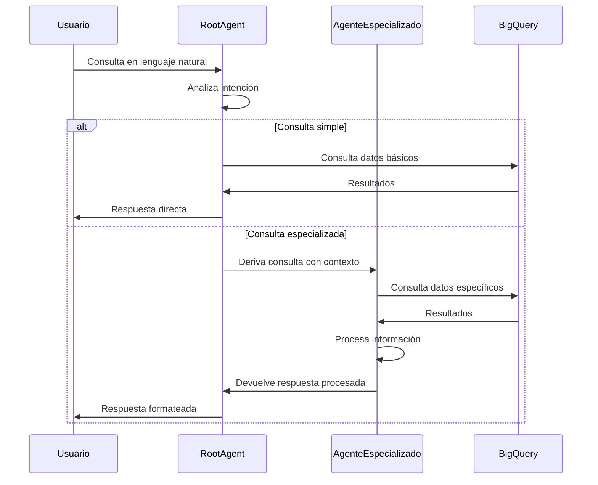
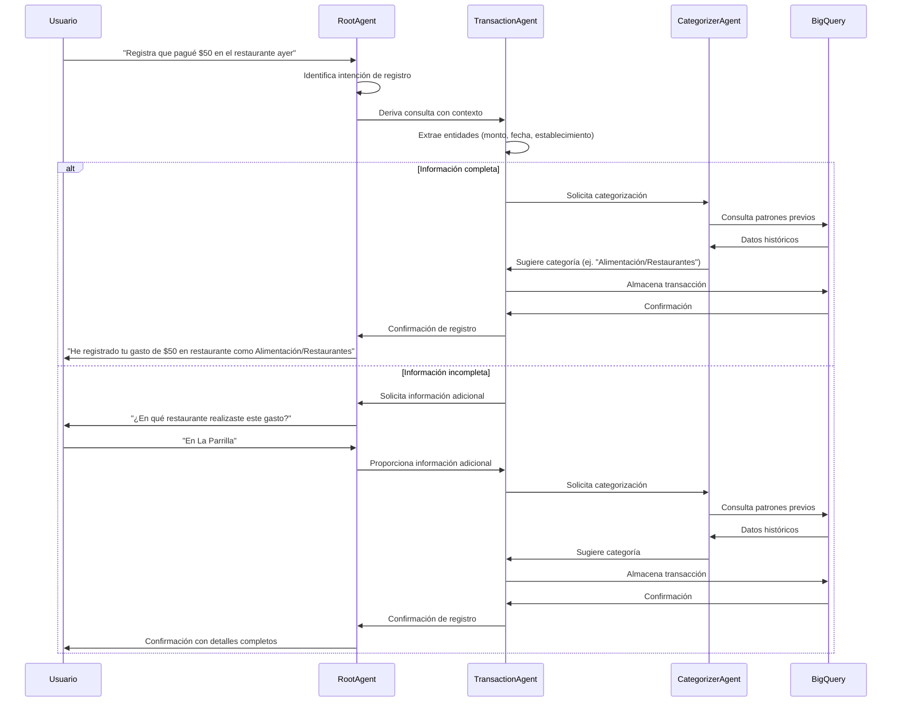
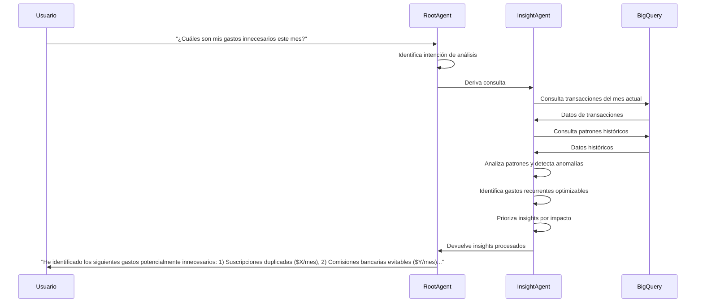
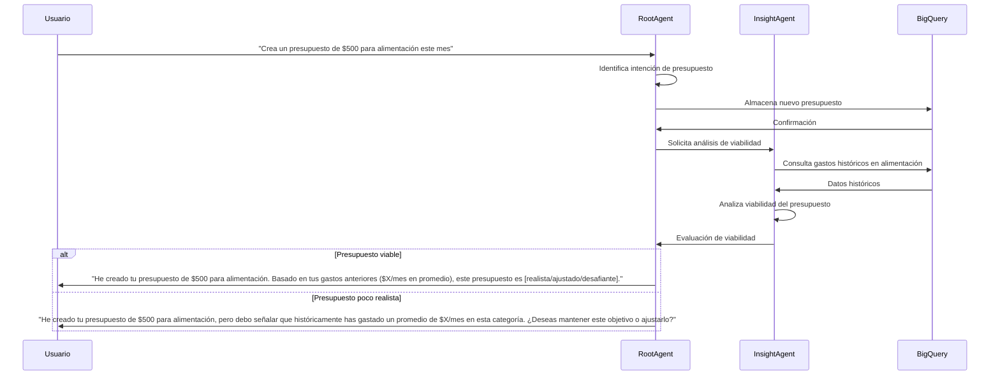
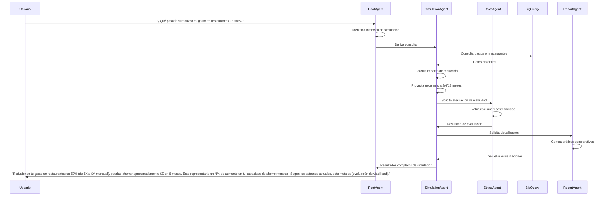
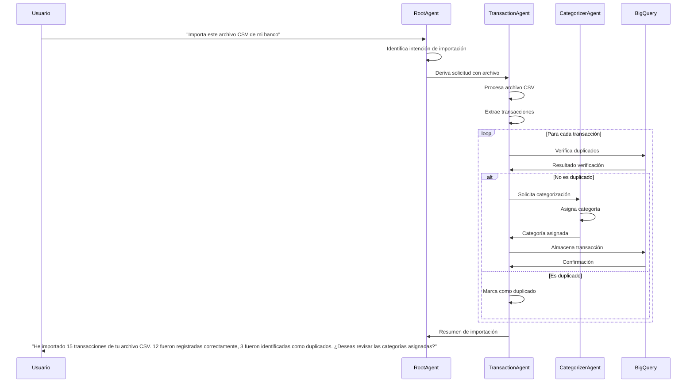
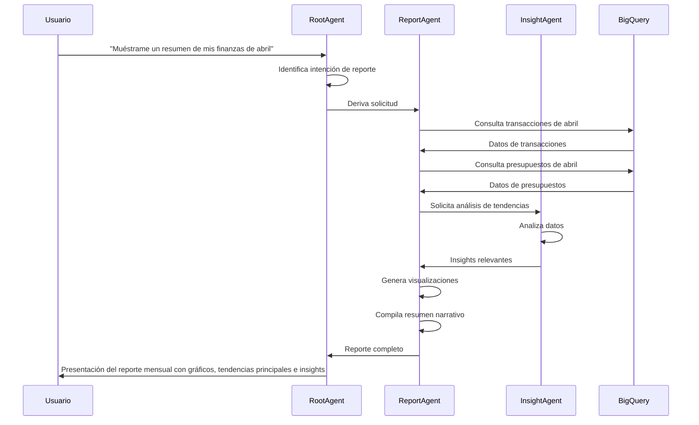
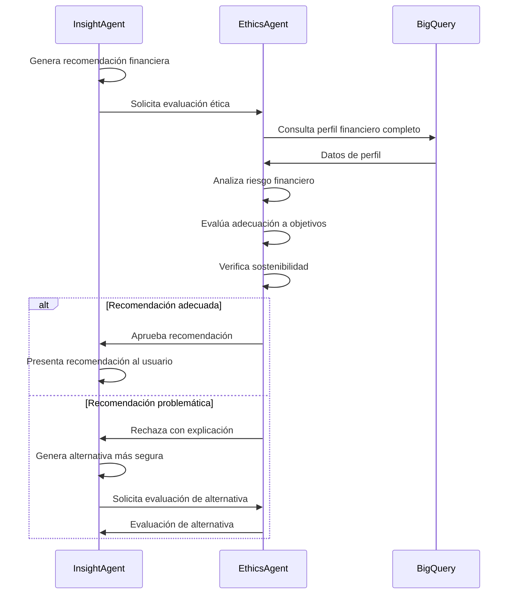
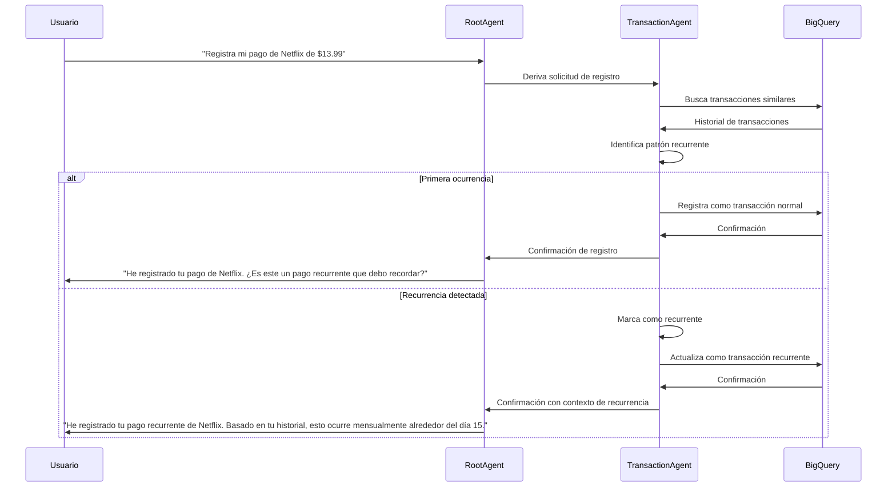
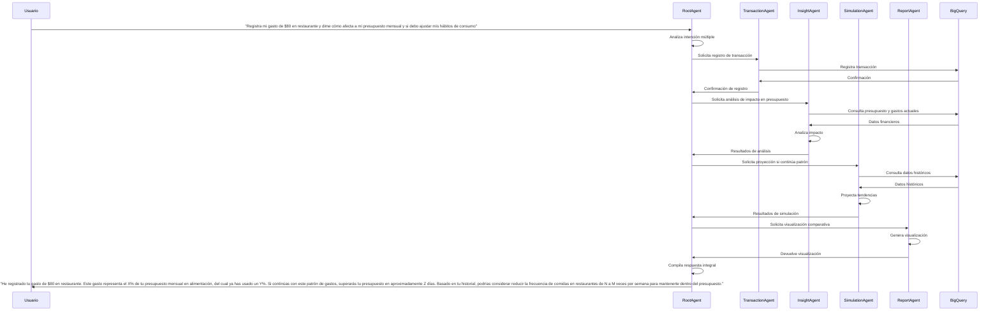

# Flujos de Interacción y Diagramas de Secuencia

Este documento describe los principales flujos de interacción entre el usuario y los agentes de FinAssist, así como los diagramas de secuencia para los casos de uso más importantes.

## 1. Flujo de Procesamiento Principal

## 2. Registro de Transacción

## 3. Análisis de Gastos y Generación de Insights

## 4. Creación y Seguimiento de Presupuesto

## 5. Simulación Financiera

## 6. Importación de Transacciones desde CSV

## 7. Generación de Reporte Mensual

## 8. Flujo de Evaluación Ética de Recomendación

## 9. Flujo de Detección y Categorización de Transacción Recurrente

## 10. Flujo Completo Multi-Agente para Consulta Compleja

## Notas sobre los Flujos de Interacción

1. **Coordinación centralizada**: El RootAgent actúa siempre como punto central de coordinación, manteniendo el contexto de la conversación y asegurando coherencia en las respuestas.

2. **Flujos paralelos vs. secuenciales**: Para consultas que involucran múltiples agentes, generalmente se sigue un flujo secuencial donde el resultado de un agente alimenta al siguiente, aunque en algunos escenarios podrían ejecutarse procesos paralelos.

3. **Manejo de contexto**: El contexto del usuario (preferencias, historial reciente) se mantiene en memoria durante la sesión y se pasa entre agentes según sea necesario.

4. **Gestión de errores**: No representada explícitamente en los diagramas, pero cada interacción incluye manejo de errores (datos no disponibles, ambigüedad en la consulta, etc.).

5. **Optimización de consultas**: En implementación real, se optimizarían las consultas a BigQuery para minimizar carga y costos, agrupando consultas relacionadas cuando sea posible.

6. **Umbral de confianza**: Los agentes utilizan umbrales de confianza para determinar cuándo solicitar clarificación vs. proceder con la información disponible.

7. **Aprendizaje adaptativo**: A lo largo del tiempo, los agentes mejoran sus respuestas basadas en el historial de interacciones, aunque esto no se muestra explícitamente en los diagramas.